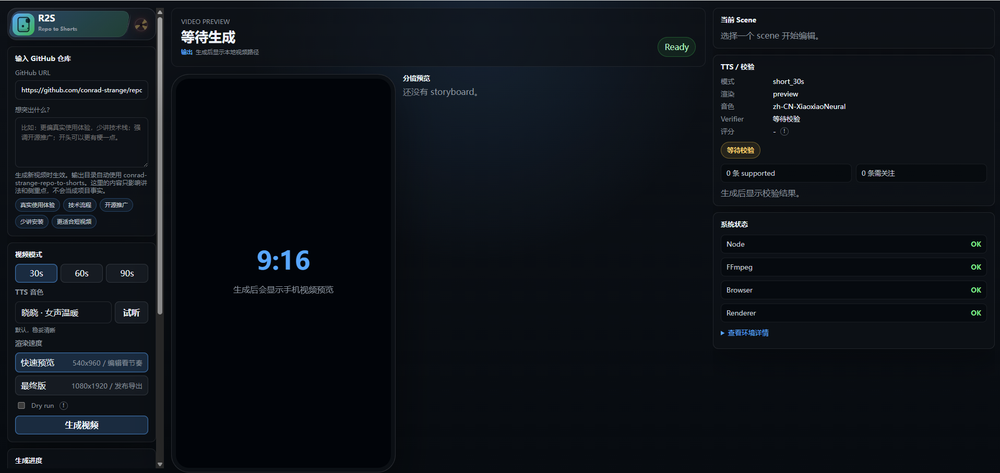
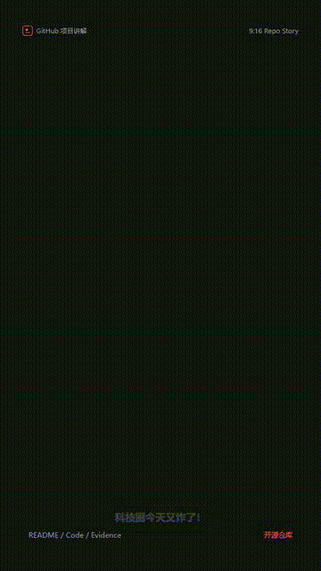
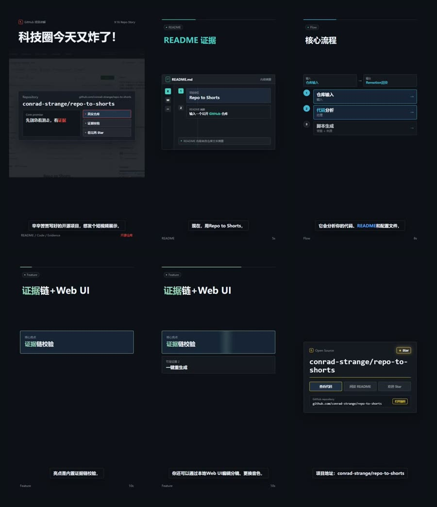

<h1 align="center">Repo to Shorts</h1>

<p align="center">
  输入一个公开 GitHub 仓库，生成中文 9:16 项目讲解短视频。
  Repo to Shorts 面向的是“想快速展示项目价值的开发者”，不是复杂视频剪辑器。
</p>

<p align="center">
  
  
  
  
</p>

---

## What It Does

Repo to Shorts 是一个面向开源开发者的 AI 视频生成工具。它会读取公开 GitHub 仓库的 README、目录结构、配置文件和核心代码，生成中文讲解稿、分镜、字幕、TTS 配音，并用 Remotion 渲染成适合手机平台发布的竖屏 MP4。

## Preview

<p align="center">
  
</p>

<p align="center">
  
</p>

<p align="center">
  
</p>

## Features

当前主线是：

```text
GitHub Repo
  -> Repo Analyzer
  -> Evidence Index
  -> Script / Storyboard Agents
  -> Verifier / Repair
  -> Edge TTS + Captions
  -> Remotion Renderer
  -> 9:16 MP4
```

<table>
  <tr>
    <td><strong>GitHub 输入</strong></td>
    <td>输入公开仓库 URL，自动 clone 并分析项目内容。</td>
  </tr>
  <tr>
    <td><strong>证据链</strong></td>
    <td>基于 README、配置文件和代码生成内容，减少无依据夸大。</td>
  </tr>
  <tr>
    <td><strong>中文脚本</strong></td>
    <td>生成适合短视频节奏的讲解稿、分镜和字幕 cue。</td>
  </tr>
  <tr>
    <td><strong>程序化视频</strong></td>
    <td>Remotion 渲染 9:16 MP4，支持 preview / final 两档输出。</td>
  </tr>
  <tr>
    <td><strong>Web UI</strong></td>
    <td>本地 FastAPI + React 界面，支持分镜编辑、TTS 音色选择、生成新版。</td>
  </tr>
  <tr>
    <td><strong>Repo to Bombs</strong></td>
    <td>实验性的引流模式，用更夸张的 hook 包装开场，但项目事实仍走校验。</td>
  </tr>
</table>

## Quick Start

### 1. Python

```powershell
conda create -n repo-video-agent python=3.11 -y
conda activate repo-video-agent
pip install -r requirements.txt
pip install -e backend
```

### 2. Setup

Windows 推荐使用项目内 portable tools：

```powershell
gva setup --portable
```

它会自动完成：

```text
1. 创建 .env
2. 下载 Node.js / FFmpeg 到 .tools/
3. 写入 NODE_EXE / NPM_CMD / FFMPEG_EXE
4. 提示填写 LLM API key
5. 安装 renderer 和 frontend 的 npm 依赖
6. 构建 Web UI
7. 运行 gva doctor
```

`.tools/` 只提交 `.gitkeep`，实际下载内容不会上传到 GitHub。

如果你已经在系统中安装了 Node.js、npm 和 FFmpeg，也可以使用：

```powershell
gva setup
```

### 3. LLM Provider

默认使用 DeepSeek。`gva setup` 会在缺少 key 时用隐藏输入提示填写：

```text
LLM_PROVIDER=deepseek
DEEPSEEK_API_KEY=your_key
DEEPSEEK_MODEL_REASONING=deepseek-v4-pro
DEEPSEEK_MODEL_GENERATION=deepseek-v4-flash

NODE_EXE=D:\path\to\node.exe
NPM_CMD=D:\path\to\npm.cmd
FFMPEG_EXE=D:\path\to\ffmpeg.exe
CHROME_EXE=C:\Program Files\Google\Chrome\Application\chrome.exe
```

Edge TTS 默认不需要 API key。

也可以切换到其他 LLM：

```text
# Official OpenAI
LLM_PROVIDER=openai
OPENAI_API_KEY=your_key
OPENAI_MODEL_REASONING=gpt-5.2
OPENAI_MODEL_GENERATION=gpt-5-mini

# Any OpenAI-compatible endpoint
LLM_PROVIDER=openai_compatible
OPENAI_COMPATIBLE_API_KEY=your_key
OPENAI_COMPATIBLE_BASE_URL=https://example.com/v1
OPENAI_COMPATIBLE_MODEL_REASONING=your-reasoning-model
OPENAI_COMPATIBLE_MODEL_GENERATION=your-fast-model
```

`openai_compatible` 适合接入 OpenRouter、SiliconFlow、Moonshot、DashScope 等兼容 OpenAI Chat Completions 的服务。不同平台的 model id 和 base URL 不一样，请以各自控制台为准。

### 4. Check Environment

```powershell
gva doctor
```

`doctor` 会检查 Python、`.env`、LLM provider、Node.js、npm、FFmpeg、Chrome、frontend build 和 renderer 依赖状态。

## Usage

### Web UI

```powershell
conda activate repo-video-agent
gva ui
```

打开：

```text
http://127.0.0.1:7860
```

网页端默认使用 `short_30s + preview`，适合快速看节奏；确认后可切换到 `final` 输出 1080x1920 MP4。

### CLI

```powershell
conda run -n repo-video-agent gva render `
  --repo https://github.com/conrad-strange/rag-demo `
  --out outputs/rag-demo `
  --video-mode short_30s `
  --render-profile final `
  --no-dry-run
```

## Output

每次生成都会创建独立 run：

```text
outputs/<project>/runs/0001/
  repo-summary.json
  repo-evidence-index.json
  project-insight.json
  video-script.json
  script.md
  storyboard.json
  storyboard.final.json
  storyboard-timed.json
  verification-report.json
  evaluation-report.json
  subtitles.srt
  subtitles.vtt
  demo_report.md
  audio/
  assets/
  preview_frames/
  video.mp4
```

最终视频：

```text
outputs/<project>/runs/<run_id>/video.mp4
```

`outputs/` 默认不会提交到 GitHub。

## Project Structure

```text
backend/      Python workflow、agents、models、CLI、FastAPI API
frontend/     React/Vite 本地 Web UI
renderer/     Remotion 竖屏视频模板
docs/         架构、输出产物、Web UI 规划
examples/     示例 storyboard
outputs/      本地生成结果，默认不提交
scripts/      本地工具脚本
```

## Current Limits

- 当前默认生成中文视频，英文 TikTok / YouTube Shorts 输出在后续计划中。
- Web UI 只支持公开 GitHub 仓库 URL。
- 当前不自动运行目标项目截图，避免依赖、端口、数据库和 API key 让 MVP 不稳定。
- Verifier 是辅助校验，发布前仍建议人工检查最终视频和 `verification-report.md`。

## Roadmap

- 英文输出 profile：TikTok / YouTube Shorts 风格的 hook、字幕和 TTS。
- 更丰富的 scene 模板：README 滚动、代码聚焦、架构图、结果画面。
- 更精确的字幕 timing：接入支持 word boundary 的 TTS。
- 更强的证据链：claim 级定位、自动降级改写。
- 更完整的 Web 工作流：任务历史、渲染队列、失败恢复和下载页。

## License

MIT
